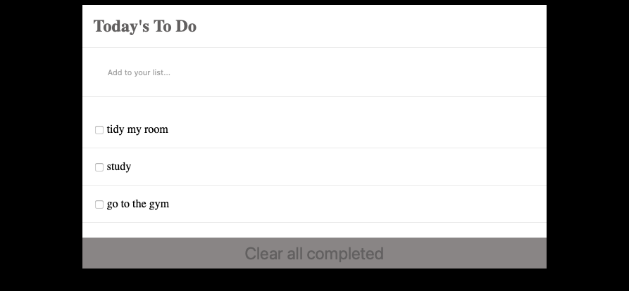

# To Do List

## Built With

- Javascript
- Html
- CSS
- Webpack

## App description
It is a website where you can add different task to your To Do List.

## Pre requisites
have npx installed

## Getting Started
1- Get a copy of the repository running this command in your OS terminal: `git clone https://github.com/disc3110/to-do-list.git` to get a copy of the project.

2- go to the project folder using `cd ./to-do-list`

3- run `npm install`

4- run `npm run start` 

👤 **Author **

- GitHub: [disc3110](https://github.com/disc3110)
- Twitter: [Diego Ivan Solis](https://twitter.com/disc3110)

## 🤝 Contributing

Contributions, issues, and feature requests are welcome!

Feel free to check the [issues page](https://github.com/disc3110/to-do-list/issues).

## Show your support

Give a ⭐️ if you like this project!

## Acknowledgments

-  Microverse
